# DBMS Final Project Report : 電影論壇
#### `NE6081014` `陳冠友`
## 系統架構
|  系統架構   |     |
|:---:|:---:|
| OS  | Ubuntu 18.04 |
| 後端語言 | Python3 |
| web server 套件 | Flask |
| SQL Database | MySQL |
### ER Model
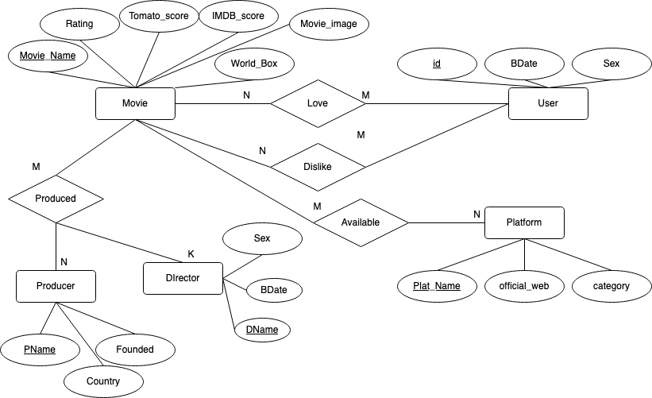
### Relational Schema
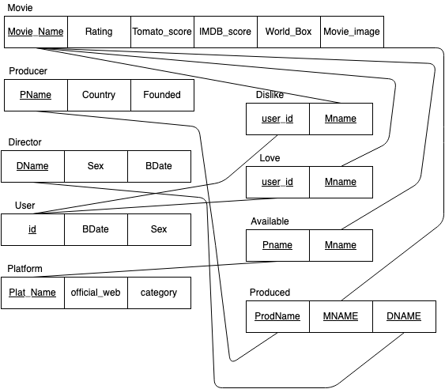
### Table attribute 與 relation 意義
#### `Movie` Entity
| Attribute |  意義  |
| :---: | :---: |
| **Movie_Name** | Primary Key 表示電影名稱 |
| Rating | 電影分級 |
| Tomato_score | 該電影的爛番茄影評分數 |
| IMDB_score | 該電影的 IMDB 評分 |
| World_Box | 該電影的全球票房 |
| Movie_image | 該電影的海報 |
#### `User` Entity
| Attribute | 意義 |
| :---: | :---: |
| **id** | Primary Key 使用者 ID |
| BDate | 使用者生日 |
| Sex | 使用者性別 |
#### `Producer` Entity
| Attribute | 意義 |
| :---: | :---: |
| **PName** | Primary Key 電影製造商名稱 |
| Country | 電影製造商國籍 |
| Founded | 電影製造商成立日期 |
#### `Director` Entity
| Attribute | 意義 |
| :---: | :---: |
| **DName** | Primary Key 導演名稱 |
| BDate | 導演生日 |
| Sex | 導演的性別 |
#### `Platform` Entity
| Attribute | 意義 |
| :---: | :---: |
| **Plat_Name** | Primary Key 電影播放平台或業者名稱 |
| official_web | 電影播放平台或業者官方網站 |
| category | 電影播放業者分類 屬於串流還是傳統電影院 |
#### `Dislike` Relation
紀錄使用者對某部電影給予的負評
| Attribute | 意義 |
| :---: | :---: |
| **user_id** | 使用者 ID |
| **Mname** | 電影名稱 |
#### `Love` Relation
紀錄使用者對某部電影給予的正向評價
| Attribute | 意義 |
| :---: | :---: |
| **user_id** | 使用者 ID |
| **Mname** | 電影名稱 |
#### `Available` Relation
紀錄電影在哪些平台能夠觀賞
| Attribute | 意義 |
| :---: | :---: |
| **Pname** | 平台名稱 |
| **Mname** | 電影名稱 |
#### `Produced` Relation
紀錄該電影的導演是誰以及由哪一家製片商發行
| Attribute | 意義 |
| :---: | :---: |
| **ProdName** | 片商名稱 |
| **MNAME** | 電影名稱 |
| **DNAME** | 導演名稱 |

## 系統介面
### 主畫面
顯示資料庫中前 12 部電影的電影名與電影海報，右上角提供前往主畫面的捷徑，左邊則為控制欄選單開關鈕。  
主畫面提供兩個搜尋方式
- 搜尋 `Movie` 或 `User` 資訊
  - 下拉選單後，輸入電影名稱或使用者 ID 則可查詢電影或使用者資訊
- 進階電影排序
  - 顯示 `IMDB` 最高分電影
  - 顯示 `爛番茄` 最高分電影
  - 顯示 `IMDB` 最低分電影
  - 顯示 `爛番茄` 最低分電影
  - 顯示 `使用者正面評價` 大於 3 的電影   

#### 電影搜尋結果

#### 使用者搜尋結果
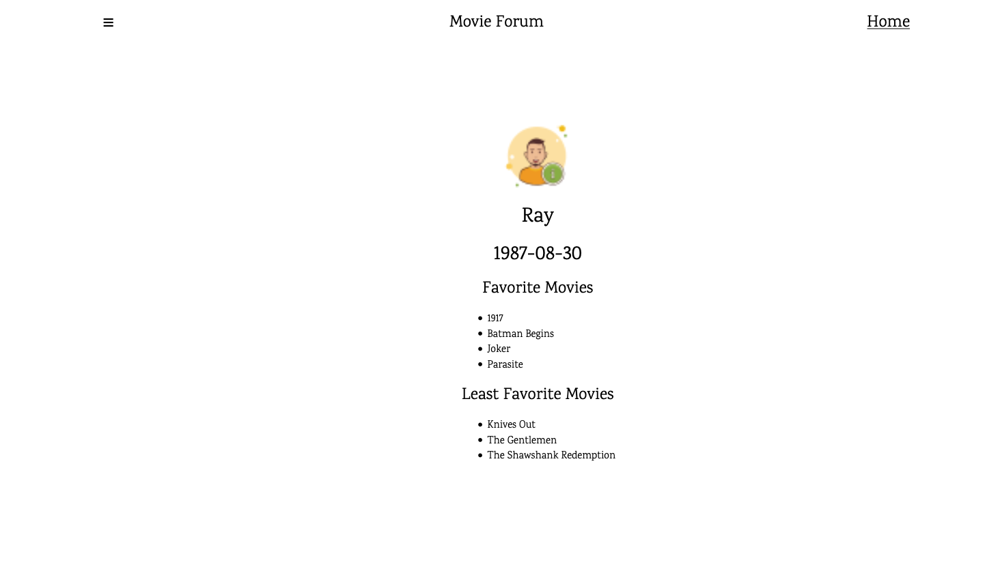
#### IMDB 最高分影片
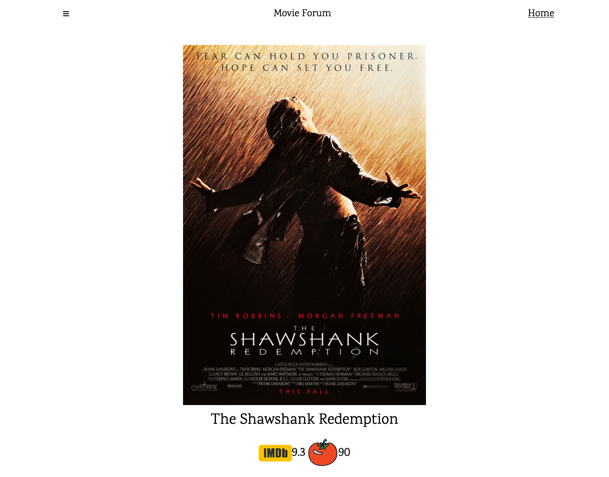
#### 爛番茄 最高分影片
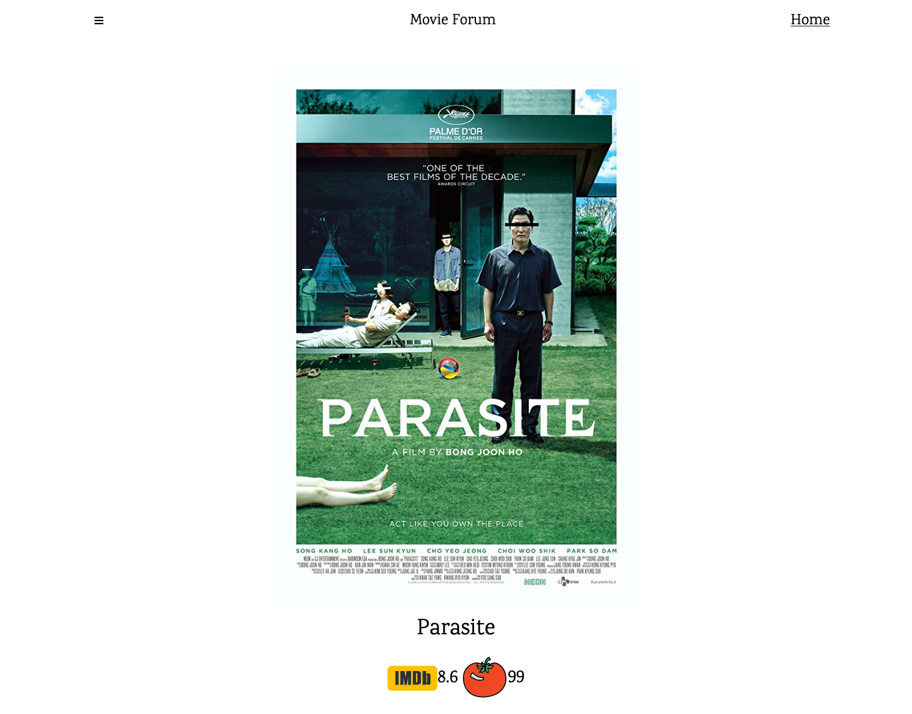
#### IMDB 最低分影片
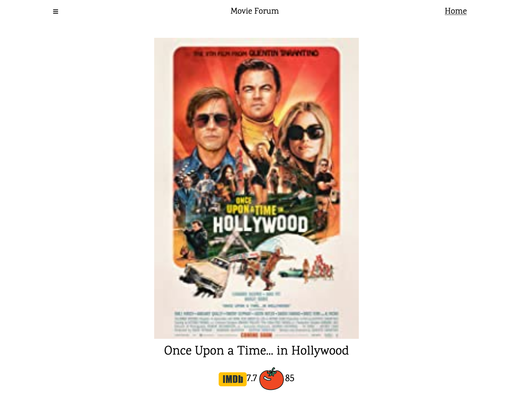
#### 爛番茄 最低分影片
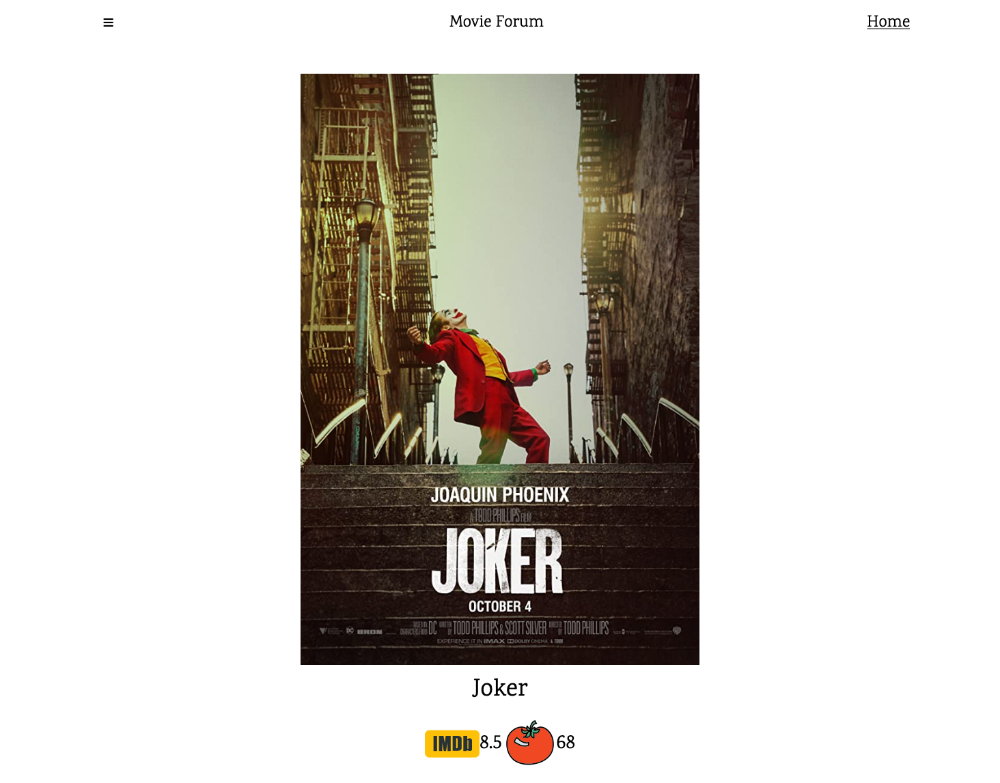
#### 使用者正面評價數大於 3 
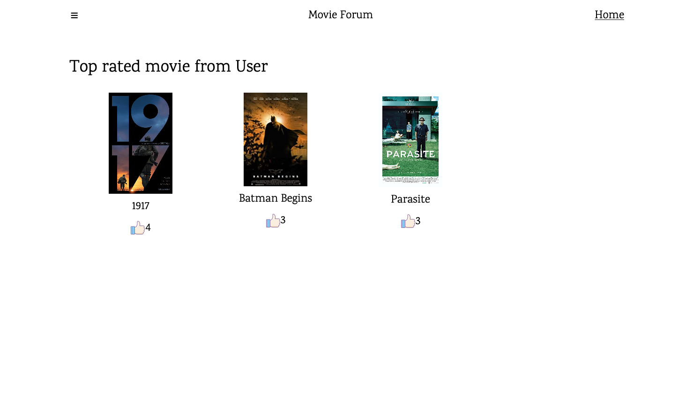

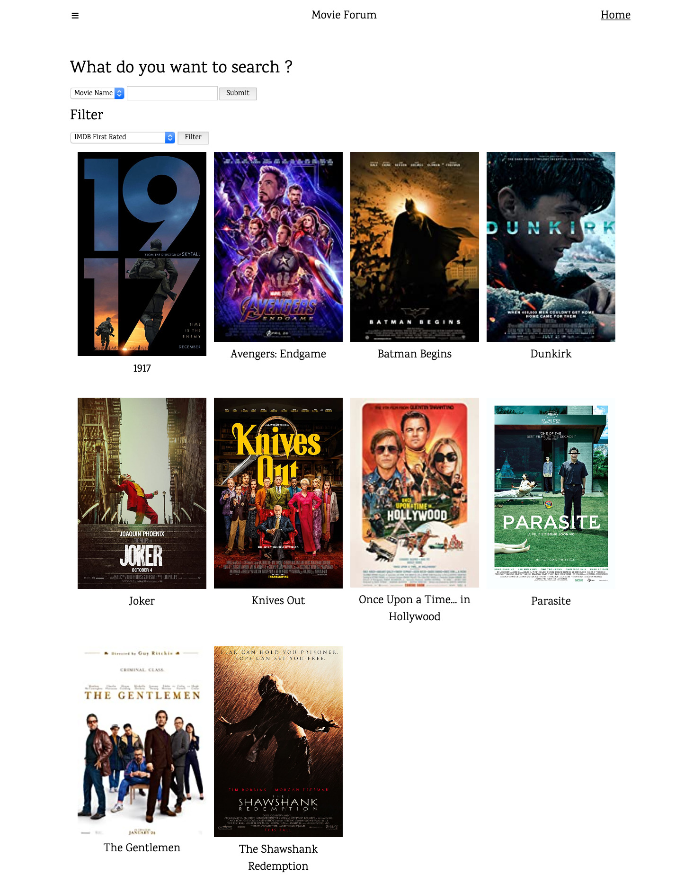
### 左側控制欄
提供前往資料庫操作區的介面
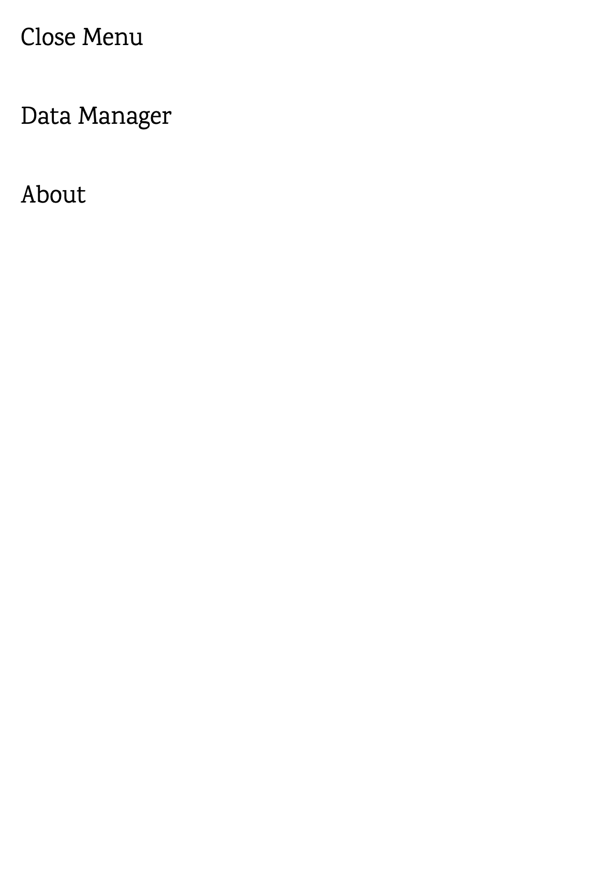
### 資料庫控制頁面
讓使用者能夠利用 `SQL` 語法或 `GUI` 對 `Movie` table 進行 `INSERT` `DELETE` `UPDATE` 操作
- Manage Movie Entity
  - 前往 `GUI` 介面
- SQL interface for Movie Entity
  - 前往 `SQL` 介面

### SQL 操作介面
輸入 `SQL` 語法按下送出後，則會更新 `Movie` table 內的資料並顯示 
#### Before
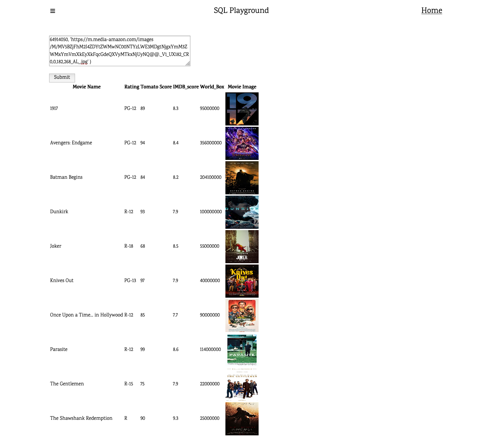
#### After
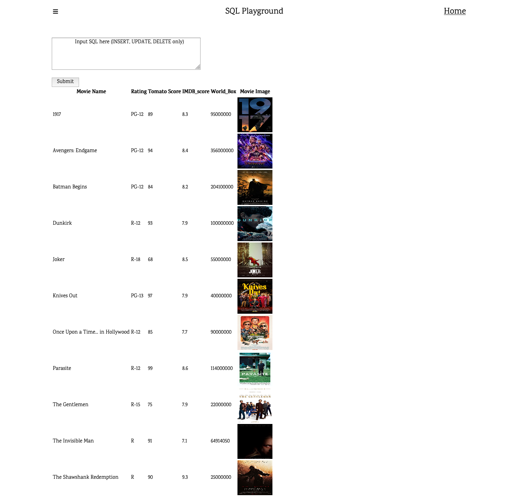

